# MetaSSR Framework Comparison

**Date:** 2026-02-20 02:38:27  
**Mode:** Local processes

## System Information

| Property     | Value                                |
| ------------ | ------------------------------------ |
| OS           | Linux 6.12.66-1-lts                  |
| Architecture | x86_64                               |
| CPU          | 13th Gen Intel(R) Core(TM) i5-13500H |
| CPU Cores    | 16                                   |
| Memory       | 15.3 GB                              |

## Requests per Second

```mermaid
xychart-beta
    title "Requests per Second"
    x-axis ["Light", "Medium", "Heavy", "Stress"]
    y-axis "RPS"
    bar [92753, 301913, 391876, 347885]
    bar [1704, 1725, 1924, 2009]
```

Legend: bars in order — MetaSSR, Next.js

## Average Latency

```mermaid
xychart-beta
    title "Average Latency (ms)"
    x-axis ["Light", "Medium", "Heavy", "Stress"]
    y-axis "ms"
    bar [0.09, 0.14, 0.50, 1.40]
    bar [6.51, 30.83, 96.31, 134.61]
```

Legend: bars in order — MetaSSR, Next.js

## P99 Latency

```mermaid
xychart-beta
    title "P99 Latency (ms)"
    x-axis ["Light", "Medium", "Heavy", "Stress"]
    y-axis "ms"
    bar [0.16, 0.68, 1.62, 5.09]
    bar [21.53, 105.59, 223.04, 239.96]
```

Legend: bars in order — MetaSSR, Next.js

## Detailed Results

### Light Load

| Framework | RPS    | Avg Latency | P99 Latency | Requests | Errors |
| --------- | ------ | ----------- | ----------- | -------- | ------ |
| MetaSSR   | 92,753 | 85.29us     | 164.00us    | 927,558  | OK     |
| Next.js   | 1,704  | 6.51ms      | 21.53ms     | 17,042   | OK     |

### Medium Load

| Framework | RPS     | Avg Latency | P99 Latency | Requests  | Errors |
| --------- | ------- | ----------- | ----------- | --------- | ------ |
| MetaSSR   | 301,913 | 139.93us    | 679.00us    | 6,068,408 | OK     |
| Next.js   | 1,725   | 30.83ms     | 105.59ms    | 34,546    | OK     |

### Heavy Load

| Framework | RPS     | Avg Latency | P99 Latency | Requests   | Errors |
| --------- | ------- | ----------- | ----------- | ---------- | ------ |
| MetaSSR   | 391,876 | 499.93us    | 1.62ms      | 11,769,181 | OK     |
| Next.js   | 1,924   | 96.31ms     | 223.04ms    | 57,906     | OK     |

### Stress Load

| Framework | RPS     | Avg Latency | P99 Latency | Requests   | Errors |
| --------- | ------- | ----------- | ----------- | ---------- | ------ |
| MetaSSR   | 347,885 | 1.40ms      | 5.09ms      | 13,950,074 | OK     |
| Next.js   | 2,009   | 134.61ms    | 239.96ms    | 80,589     | OK     |

## Summary Comparison

| Metric         | MetaSSR    | Next.js |
| -------------- | ---------- | ------- |
| Avg RPS        | 283,607    | 1,841   |
| Avg Latency    | 0.53       | 67.06   |
| Avg P99        | 1.89       | 147.53  |
| Total Requests | 32,715,221 | 190,083 |

## MetaSSR Advantage

### vs Next.js

| Scenario | RPS Diff  | Latency Diff | P99 Diff |
| -------- | --------- | ------------ | -------- |
| Light    | +5343.3%  | -98.7%       | -99.2%   |
| Medium   | +17393.9% | -99.5%       | -99.4%   |
| Heavy    | +20258.9% | -99.5%       | -99.3%   |
| Stress   | +17210.3% | -99.0%       | -97.9%   |

Positive RPS diff = MetaSSR is faster. Negative latency diff = MetaSSR is faster.

